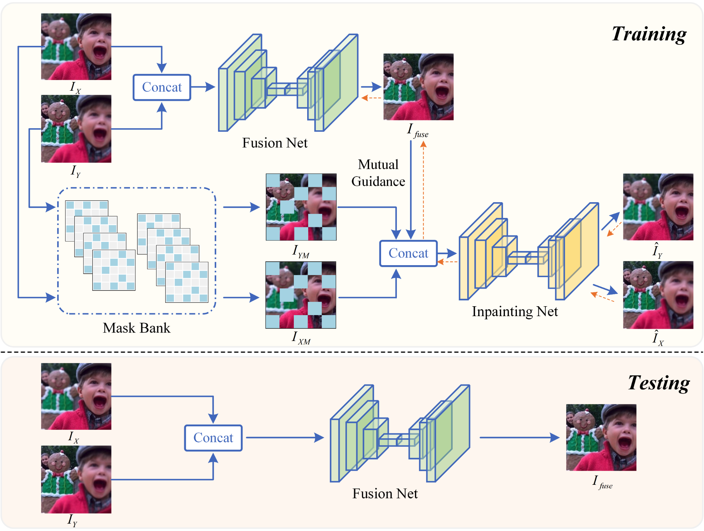

# <p align=center> :fire: `Fusion2Void: Unsupervised multi-focus image fusion guided by image inpainting (TCSVT 2024)`</p>

  [](https://zhenqifu.github.io/personal_page/23_MM1.pdf)

This is the official PyTorch codes for the paper.  
>**Fusion2Void: Unsupervised multi-focus image fusion guided by image inpainting**<br>  [Huangxing Lin<sup>](https://scholar.google.com.hk/citations?user=i3fImHEAAAAJ&hl=zh-CN), [Yunlong Lin<sup>](https://scholar.google.com.hk/citations?user=5F3tICwAAAAJ&hl=zh-CN), [Jingyuan Xia](), [Linyu Fan](), [Feifei Li](), [Yingying Wang†](https://scholar.google.com.hk/citations?user=fDVgLA0AAAAJ&hl=zh-CN), [Xinghao Ding](https://scholar.google.com.hk/citations?user=k5hVBfMAAAAJ&hl=zh-CN&oi=ao)（ † indicates corresponding author)<br>

<div align=center></div>

## Abstract
> Multi-focus image fusion aims to integrate clear
segments from different partially focused images, creating an
‘all-in-focus’ composite. Due to the lack of ground-truth for
multi-focus image fusion, supervised deep learning methods are
deemed inappropriate for this task. In this paper, we present
an unsupervised approach for multi-focus image fusion, named
Fusion2Void. Fusion2Void ingeniously tackles the challenge of
missing ground-truth by framing image inpainting as an auxiliary task. Specifically, Fusion2Void utilizes a fusion network to
merge focused regions from multiple source images. Following
the fusion process, image patches in the source images are
randomly dropped to construct an additional image inpainting
task. Subsequently, an image inpainting network uses the fused
image as a guide to restore the missing content in the source
images. The missing content in the source images includes
both focused and defocused regions. Restoring focused image
patches is significantly more challenging than restoring their
defocused counterparts due to their inclusion of more highfrequency details. If the focused image patches are effectively
restored, the repair of the defocused image patches becomes
notably easier. Therefore, the image inpainting network implicitly
compels the fused image to incorporate all focused content from
the source images, as these can be utilized to restore the missing
focused regions in the source images perfectly. Based on image
inpainting, the fusion network generates ‘all-in-focus’ images
in an unsupervised manner. Experiments on several synthetic
and real-world datasets highlight Fusion2Void’s state-of-the-art
performance relative to other methods.


## Dependencies and Installation
- Ubuntu >= 18.04
- CUDA >= 11.0
- NumPy
- Matplotlib
- OpenCV
- PyYAML
```
# git clone this repository
git clone https://github.com/LYL1015/Fusion2Void.git
cd Fusion2Void

# create new anaconda env
conda create -n Fusion2Void python=3.8
conda activate Fusion2Void

pip install -r requirements.yml
```
## Datasets
- [Lytro](http://mansournejati.ece.iut.ac.ir/content/lytro-multi-focus-dataset)
- [MFI-WHU](https://github.com/HaoZhang1018/MFI-WHU)
- [MFFW](https://github.com/lmn-ning/ImageFusion/tree/main/FusionDiff/Dataset/Multi-Focus-Images/valid/MFFW)

## Testing the Model

To test the trained the model, you can run the following command:

```
python test.py
```

## Training the Model

To train the model, you can run the following command:

```
python train_pl.py
```


## Citation

If you find Fusion2Void is useful in your research, please cite our paper:

```
@article{lin2024fusion2void,
  title={Fusion2Void: Unsupervised Multi-focus Image Fusion Based on Image Inpainting},
  author={Lin, Huangxing and Lin, Yunlong and Xia, Jingyuan and Fan, Linyu and Li, Feifei and Wang, Yingying and Ding, Xinghao},
  journal={IEEE Transactions on Circuits and Systems for Video Technology},
  year={2024},
  publisher={IEEE}
}
```

